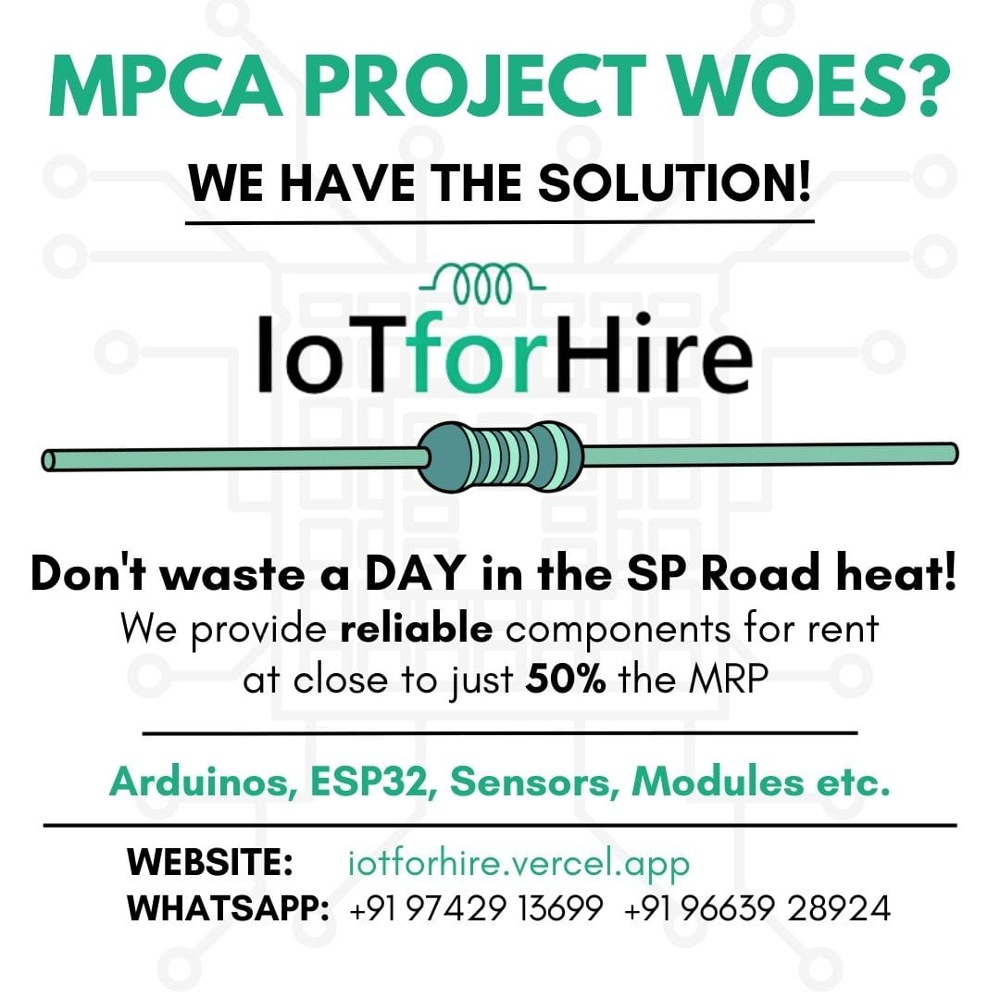

# IoTforHire-Website

  
🌐 Official repository for the IoTforRent Website 💻 📱. 
 
Rent IoT components on short/long-term basis. 
 
Catalog, ordering system, FAQs, and blog included.
 
We are pleased to help the student community in our college networking
 
with all IoT enthusiasts around us.

For our fellow second-year peeps tired and struggling to find reliable and pocket-friendly  
*IoT components* for their *MPCA projects* spending alot of time going around shops in SP Road 
 and coming up with faulty components. Here's the repository catering to the needs of  
 100's of students in our college.

Look no further *IoT-for-Hire* – is here 💡 exclusively for the student community bringing together IoT enthusiasts who want to rent their components and provide valuable knowledge to those in need! 
 Our site provides an interface to connect IoT enthusiasts with non-enthusiasts allowing them  
 to connect to an overwhelming IoT community out there wanting to help people.
 
 
The site has a huge catalogue of tested components to meet all the needs of second year fellows in our college. 
You have the option to:
- Choose your components 
- fill the form and collect them at campus the next day! Its that *simple*

We go by the slogan: 
> Make the smart choice, start building today with *IoT-for-Hire* today! 💪

### Developed by:

